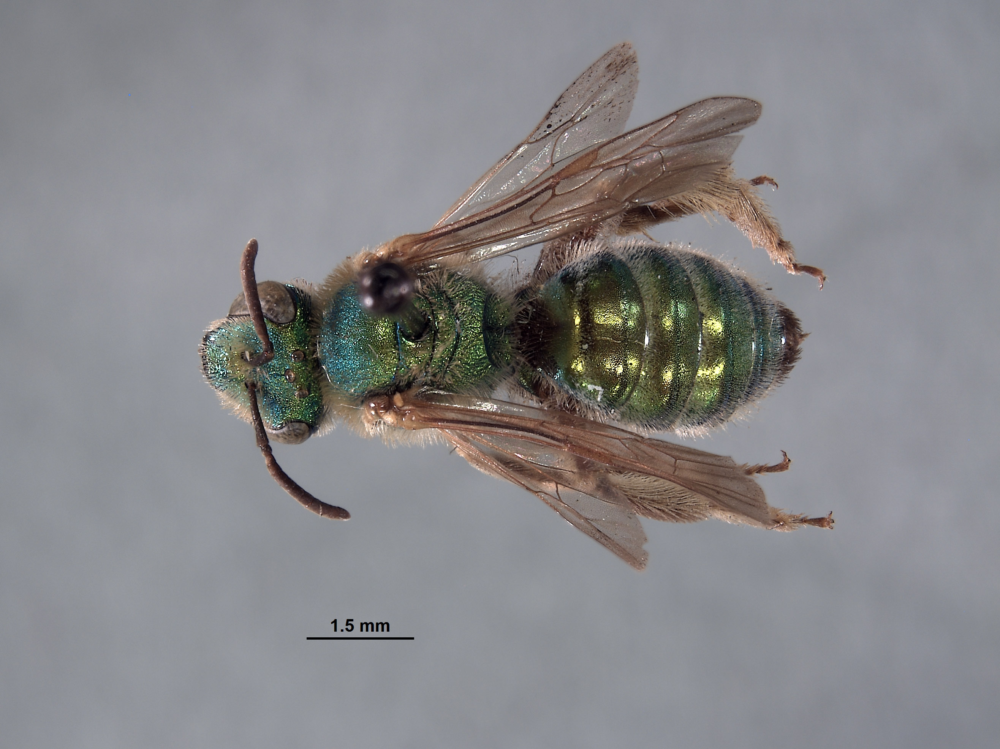
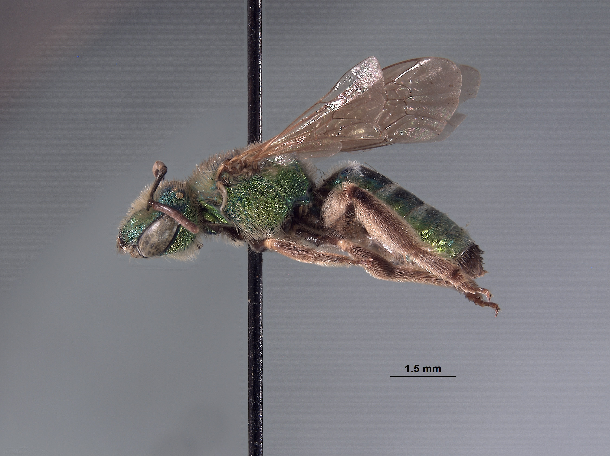
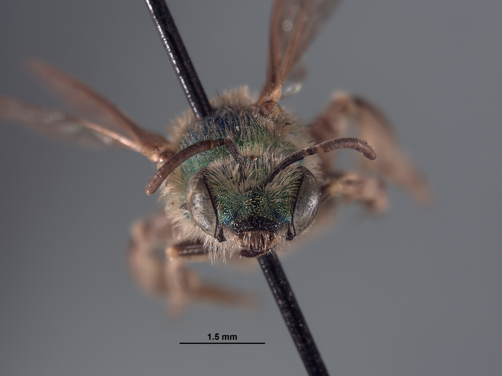
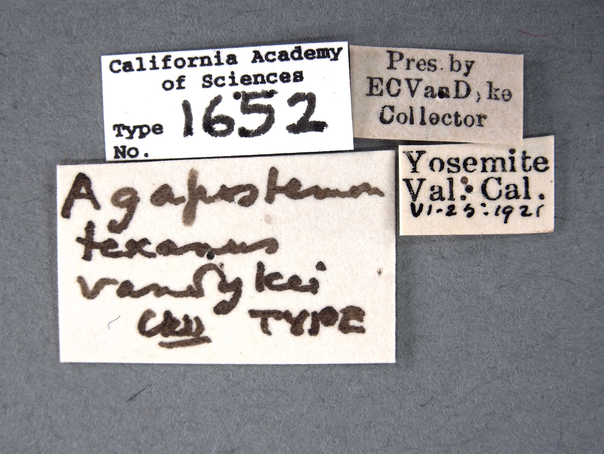

# Bee Image Finder

This repository helps to generate cc0 licensed images of (type) specimen in the Big Bee collection family. 

Checkout the [samples](#images).

## Prerequisites

 * linux, mac os x, or Windows Subsystem for Linux https://en.wikipedia.org/wiki/Windows_Subsystem_for_Linux
 * Preston https://github.com/bio-guoda/preston
 * zip
 * jq 
 * parallel

## Usage


```
./find-images [catalog number] [dwca URL]
```

where 

`catalog number` is the catalog number of the specimen you'd like to generate an image sequence for.

and

`dwca/rss URL` is location of the Darwin Core Archive or RSS feed of Darwin Core Archives that includes a specimen with the catalog number 

This can be combines with other programs like `cat` to generate image sequences for a list of catalogNumbers:

```
cat catalogNumbers.txt\
 | xargs -L1 ./find-images.sh 
```

or, if you'd like to do it in parallel:

```
cat catalogNumbers.txt\
 | parallel ./find-images.sh {1}
```
Note that the catalog numbers are consist of a type specimen in bee families Andrenidae, Apidae, Colletidae, Halictidae, Megachilidae, Melittidae, and Stenotritidae, in California Academy of Sciences Entomology Type collections that had images on 2023-02-24. 


## Results

If found, images of type specimen will be available in folder `dist/[catalog number]/` . 

## Publication

The distributions are optimized for publication to Zenodo. See https://github.com/jhpoelen/zenodo-upload for ways to do this programmatically.

## Example

```
./find-images.sh "CASTYPE1652" "http://ipt.calacademy.org:8080/archive.do?r=type"
```

produced the following flat (Zenodo compatible) output in the `dist/CASTYPE1652` folder as shown below.

### dist content

```
2a5de79372318317a382ea9a2cef069780b852b01210ef59e06b640a3539cb5a
2f883c566c9d2fb43f224a78dd9c8d8840e076fc79cb743cad995c07b9c1cebd
3c1490de3e4227eddc5298c13e1b2ec74cfc1fbc8a859e2a90ad6d628bdf2630
6ec063094e918bd9775e388454b13c7beca86360094c90091780661e541daa63
7b2312031d53a8aa988fc26d9500eaf912e82b0b384d21ab863b818d59e68adb
9214e3daede6469cf04dc5d02d1c97294400018d7ef59915ebe08e2f13490227
93419ced9f17e73b58f7e6b38f63dc7bb3c77621e0793ec2b3104c53d7233d7e
a7ec710118a8d697f530e72bf8ca1bf7bf10198e7d1428fe037d65fce0c75176
a9dfff301047a09ea6bd67a20e9eaad581c19515caafc9a9c0bc3e5b2b505f14
abd40c26912d598dafe1e37b66a41178ee37b7ea962b04e0661c470c2fe31bab
b648301c50e54735ce6d5c782858c4442071286e123500260e4739a768089b8f
c10660702766888e0ffdc93db3f0e24cc4e878910c6aa240a56b58b297ab79e5
e11a73bd95338d63e06d8ecfa15489fa621636da534422e9d053fd3558013cce
e8b5843d123f35756c621f3723b3b0ac6eb82b89fa3f9e7729406102bcb32090
ef89d8c023ce74a4eb5dfaf9e103909b0b35a06ccf0aa8d7a04e92fbf8d7387b
f3bb3fd3f098e3276ea810a68a4983cce9303f9a714c17eadc9090c6eadf086c
f7d045b0e787710ba8755a65c1d4cc9e2ea4d83eca5280d807071b019a076fc5
imageseq.zip
label.png
README.md
```

Note that the long cryptic filenames help for machines to discover and verify content using the Preston command-line tool and associated packaging methods. For more information, see https://github.com/bio-guoda/preston or related publications:

MJ Elliott, JH Poelen, JAB Fortes (2020). Toward Reliable Biodiversity Dataset References. Ecological Informatics. https://doi.org/10.1016/j.ecoinf.2020.101132

Elliott, M. J., Poelen, J. H., & Fortes, J. (2022, August 29). Signed Citations: Making Persistent and Verifiable Citations of Digital Scientific Content. https://doi.org/10.31222/osf.io/wycjn

### Images 

Images related to type specimen CASTYPE1652 include:






### Metadata

The following metadata related to CASTYPE1652 was extracted using `preston ls | preston dwc-stream  | grep -P "CASTYPE1652[^0-9]+" | jq .`

```json
{
  "http://www.w3.org/ns/prov#wasDerivedFrom": "line:zip:hash://sha256/b648301c50e54735ce6d5c782858c4442071286e123500260e4739a768089b8f!/occurrence.txt!/L1274",
  "http://www.w3.org/1999/02/22-rdf-syntax-ns#type": "http://rs.tdwg.org/dwc/terms/Occurrence",
  "http://rs.tdwg.org/dwc/text/id": "urn:catalog:CAS:TYPE:1652",
  "http://rs.tdwg.org/dwc/terms/basisOfRecord": "PreservedSpecimen",
  "http://rs.tdwg.org/dwc/terms/collectionID": "http://grscicoll.org/institutional-collection/entomology-types",
  "http://rs.tdwg.org/dwc/terms/year": "1921",
  "http://rs.tdwg.org/dwc/terms/minimumElevationInMeters": null,
  "http://rs.tdwg.org/dwc/terms/georeferenceVerificationStatus": null,
  "http://rs.tdwg.org/dwc/terms/georeferenceSources": "GeoLocate",
  "http://rs.tdwg.org/dwc/terms/associatedTaxa": null,
  "http://rs.tdwg.org/dwc/terms/preparations": "pinned",
  "http://rs.tdwg.org/dwc/terms/recordedBy": "Edwin C. Van Dyke",
  "http://rs.tdwg.org/dwc/terms/waterBody": null,
  "http://rs.tdwg.org/dwc/terms/infraspecificEpithet": "vandykei",
  "http://rs.tdwg.org/dwc/terms/georeferencedBy": null,
  "http://rs.tdwg.org/dwc/terms/taxonRank": "ssp.",
  "http://rs.tdwg.org/dwc/terms/locality": "Yosemite Valley",
  "http://rs.tdwg.org/dwc/terms/dateIdentified": null,
  "http://rs.tdwg.org/dwc/terms/eventDate": "1921-06-25",
  "http://rs.tdwg.org/dwc/terms/stateProvince": "California",
  "http://rs.tdwg.org/dwc/terms/verbatimDepth": null,
  "http://rs.tdwg.org/dwc/terms/coordinateUncertaintyInMeters": "10077",
  "http://rs.tdwg.org/dwc/terms/individualCount": "1",
  "http://rs.tdwg.org/dwc/terms/sex": null,
  "http://rs.tdwg.org/dwc/terms/identificationQualifier": null,
  "http://rs.tdwg.org/dwc/terms/disposition": null,
  "http://rs.tdwg.org/dwc/terms/georeferenceProtocol": null,
  "http://rs.tdwg.org/dwc/terms/samplingProtocol": null,
  "http://rs.tdwg.org/dwc/terms/day": "25",
  "http://rs.tdwg.org/dwc/terms/decimalLatitude": "37.727089",
  "http://rs.tdwg.org/dwc/terms/typeStatus": "holotype",
  "http://rs.tdwg.org/dwc/terms/collectionCode": "CASTYPE",
  "http://rs.tdwg.org/dwc/terms/identifiedBy": null,
  "http://rs.tdwg.org/dwc/terms/lifeStage": "adult",
  "http://rs.tdwg.org/dwc/terms/occurrenceRemarks": null,
  "http://rs.tdwg.org/dwc/terms/fieldNumber": null,
  "http://rs.tdwg.org/dwc/terms/scientificNameAuthorship": "Cockerell, 1925",
  "http://rs.tdwg.org/dwc/terms/maximumDepthInMeters": null,
  "http://rs.tdwg.org/dwc/terms/geodeticDatum": "WGS84",
  "http://rs.tdwg.org/dwc/terms/municipality": null,
  "http://rs.tdwg.org/dwc/terms/verbatimCoordinates": null,
  "http://rs.tdwg.org/dwc/terms/otherCatalogNumbers": null,
  "http://rs.tdwg.org/dwc/terms/endDayOfYear": null,
  "http://rs.tdwg.org/dwc/terms/institutionCode": "CASC",
  "http://rs.tdwg.org/dwc/terms/month": "6",
  "http://rs.tdwg.org/dwc/terms/startDayOfYear": "176",
  "http://rs.tdwg.org/dwc/terms/catalogNumber": "CASTYPE1652",
  "http://rs.tdwg.org/dwc/terms/minimumDepthInMeters": null,
  "http://rs.tdwg.org/dwc/terms/habitat": null,
  "http://rs.tdwg.org/dwc/terms/footprintWKT": null,
  "http://rs.tdwg.org/dwc/terms/decimalLongitude": "-119.636683",
  "http://rs.tdwg.org/dwc/terms/identificationReferences": null,
  "http://rs.tdwg.org/dwc/terms/maximumElevationInMeters": null,
  "http://rs.tdwg.org/dwc/terms/verbatimEventDate": "VI-25-1921",
  "http://rs.tdwg.org/dwc/terms/fieldNotes": null,
  "http://rs.tdwg.org/dwc/terms/georeferenceRemarks": null,
  "http://rs.tdwg.org/dwc/terms/identificationRemarks": null,
  "http://rs.tdwg.org/dwc/terms/recordNumber": null,
  "http://rs.tdwg.org/dwc/terms/institutionID": "http://grbio.org/institution/california-academy-sciences",
  "http://rs.tdwg.org/dwc/terms/county": "Mariposa",
  "http://rs.tdwg.org/dwc/terms/occurrenceID": "urn:catalog:CAS:TYPE:1652",
  "http://rs.tdwg.org/dwc/terms/country": "USA",
  "http://rs.tdwg.org/dwc/terms/specificEpithet": "texanus",
  "http://rs.tdwg.org/dwc/terms/taxonRemarks": null,
  "http://rs.tdwg.org/dwc/terms/family": "Halictidae",
  "http://rs.tdwg.org/dwc/terms/genus": "Agapostemon",
  "http://rs.tdwg.org/dwc/terms/verbatimElevation": null,
  "http://purl.org/dc/terms/modified": "2022-09-30 14:17:20",
  "http://purl.org/dc/terms/language": "en",
  "http://rs.tdwg.org/dwc/terms/ownerInstitutionCode": "CASC",
  "http://rs.tdwg.org/dwc/terms/scientificName": "Agapostemon texanus vandykei Cockerell, 1925",
  "http://rs.tdwg.org/dwc/terms/locationRemarks": null
}
{
  "http://www.w3.org/ns/prov#wasDerivedFrom": "line:zip:hash://sha256/b648301c50e54735ce6d5c782858c4442071286e123500260e4739a768089b8f!/multimedia.txt!/L1552",
  "http://www.w3.org/1999/02/22-rdf-syntax-ns#type": "http://rs.gbif.org/terms/1.0/Multimedia",
  "http://rs.tdwg.org/dwc/text/coreid": "urn:catalog:CAS:TYPE:1652",
  "http://purl.org/dc/terms/type": "Still Image",
  "http://purl.org/dc/terms/identifier": "https://monarch.calacademy.org:443/mnt/target-images/CASTYPE/00001/CASTYPE1652_l.jpg",
  "http://purl.org/dc/terms/references": "https://monarch.calacademy.org/collections/individual/index.php?occid=2497037&clid=0",
  "http://purl.org/dc/terms/description": "specimen",
  "http://purl.org/dc/terms/format": "Image/jpeg"
}
{
  "http://www.w3.org/ns/prov#wasDerivedFrom": "line:zip:hash://sha256/b648301c50e54735ce6d5c782858c4442071286e123500260e4739a768089b8f!/multimedia.txt!/L1553",
  "http://www.w3.org/1999/02/22-rdf-syntax-ns#type": "http://rs.gbif.org/terms/1.0/Multimedia",
  "http://rs.tdwg.org/dwc/text/coreid": "urn:catalog:CAS:TYPE:1652",
  "http://purl.org/dc/terms/type": "Still Image",
  "http://purl.org/dc/terms/identifier": "https://monarch.calacademy.org:443/mnt/target-images/CASTYPE/00001/CASTYPE1652_label.jpg",
  "http://purl.org/dc/terms/references": "https://monarch.calacademy.org/collections/individual/index.php?occid=2497037&clid=0",
  "http://purl.org/dc/terms/description": "specimen",
  "http://purl.org/dc/terms/format": "Image/jpeg"
}
{
  "http://www.w3.org/ns/prov#wasDerivedFrom": "line:zip:hash://sha256/b648301c50e54735ce6d5c782858c4442071286e123500260e4739a768089b8f!/multimedia.txt!/L1554",
  "http://www.w3.org/1999/02/22-rdf-syntax-ns#type": "http://rs.gbif.org/terms/1.0/Multimedia",
  "http://rs.tdwg.org/dwc/text/coreid": "urn:catalog:CAS:TYPE:1652",
  "http://purl.org/dc/terms/type": "Still Image",
  "http://purl.org/dc/terms/identifier": "https://monarch.calacademy.org:443/mnt/target-images/CASTYPE/00001/CASTYPE1652_d.jpg",
  "http://purl.org/dc/terms/references": "https://monarch.calacademy.org/collections/individual/index.php?occid=2497037&clid=0",
  "http://purl.org/dc/terms/description": "specimen",
  "http://purl.org/dc/terms/format": "Image/jpeg"
}
{
  "http://www.w3.org/ns/prov#wasDerivedFrom": "line:zip:hash://sha256/b648301c50e54735ce6d5c782858c4442071286e123500260e4739a768089b8f!/multimedia.txt!/L1555",
  "http://www.w3.org/1999/02/22-rdf-syntax-ns#type": "http://rs.gbif.org/terms/1.0/Multimedia",
  "http://rs.tdwg.org/dwc/text/coreid": "urn:catalog:CAS:TYPE:1652",
  "http://purl.org/dc/terms/type": "Still Image",
  "http://purl.org/dc/terms/identifier": "https://monarch.calacademy.org:443/mnt/target-images/CASTYPE/00001/CASTYPE1652_h.jpg",
  "http://purl.org/dc/terms/references": "https://monarch.calacademy.org/collections/individual/index.php?occid=2497037&clid=0",
  "http://purl.org/dc/terms/description": "specimen",
  "http://purl.org/dc/terms/format": "Image/jpeg"
}
```
